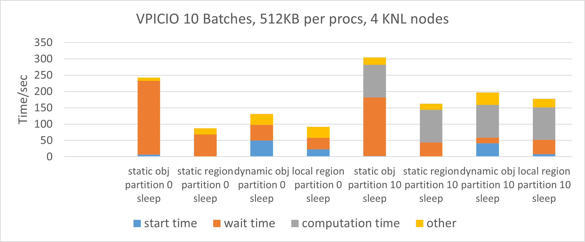

# PDC Examples
  + PDC regression tests can be found in https://github.com/hpc-io/pdc/tree/stable/src/tests.
  + Please follow the instructions for PDC installations.
  + PDC programs start with PDC servers running in the background.
  + Client programs uses PDC APIs to forward requests to PDC servers.
  + Scripts run_test.sh, mpi_test.sh, and run_multiple_tests.sh automatically run start and close PDC servers
  + Usage:
```
./run_test.sh ./pdc_client_application arg1 arg2 .....
./mpi_test.sh ./pdc_client_application MPIRUN_CMD number_of_servers number_of_clients arg1 arg2 ....
./run_multiple_test.sh ./pdc_client_application_1 ./pdc_client_application_2 ......
```
  ## PDC Hello world
  + pdc_init.c
  + A PDC program starts with PDCinit and finishes with PDCclose.
  + To a simple hello world program for PDC, use the following command.
```
0. make pdc_init
1. ./run_test.sh ./pdc_init
```
  + The script "run_test.sh" starts a server first. Then program "obj_get_data" is executed. Finally, the PDC servers are closed.
  + Alternatively, the following command can be used for multile MPI processes.
```
0. make pdc_init
1. ./mpi_test.sh ./pdc_init mpiexec 2 4
```
  + The above command will start a server with 2 processes. Then it will start the application program with 4 processes. Finally, all servers are closed.
  + On supercomputers, "mpiexec" can be replaced with "srun", "jsrun" or "aprun".
  ## Simple I-O
  + This example provides a easy way for PDC beginners to write and read data with PDC servers. It can be found in obj_get_data.c
  + Functions PDCobj_put_data and PDCobj_get_data are the easist way to write/read data from/to a contiguous memory buffer.
  + This example writes different size of data to two objects. It then read back the data to check whether the data is correct or not.
  + To run this example, use the following command lines.
```
0. make obj_get_data
1. ./run_test.sh ./obj_get_data
2. ./mpi_test.sh ./obj_get_data mpiexec 2 4
```
  ## I-O with region mapping.
  + The simple I/O can only handles 1D data that is contiguous. PDC supports data dimension up to 3. Simple I/O functions PDCobj_put_data and PDCobj_get_data are wrappers 1-dimensional object I/O poperations. The examples in this section breakdowns the wrappers, which allows more flexibility.
  + Check region_transfer_2D.c and region_transfer_3D.c for how to write 2D and 3D data.
  + Generally, PDC perform I/O with the PDCregion_transfer_create, PDCregion_transfer_start, PDCregion_transfer_wait, and PDCregion_transfer_close. The logic is similar to HDF5 dataspace and memory space. In PDC language, they are remote region and local region. The lock functions for remote regions allow PDC servers to handle concurrent requests from different clients without undefined behaviors.
  + To run thie example, use the following command lines.
```
0. make
1. ./run_test.sh ./region_transfer_2D
2. ./mpi_test.sh ./region_transfer_2D mpiexec 2 4
3. ./run_test.sh ./region_transfer_3D
4. ./mpi_test.sh ./region_transfer_3D mpiexec 2 4
```
  ## VPIC-IO and BD-CATS-IO
  + VPIC is a particle simulation code developed at Los Alamos National Laboratory (LANL). 
    VPIC-IO benchmark is an I/O kernel representing the I/O pattern of a space weather simulation
    exploring the magnetic reconnection phenomenon. More details of the simulation itself can be 
    found at vpic.pdf . 
  + BD-CATS is a Big Data clustering (DBSCAN) algorithm that uses HPC systems to analyze trillions of
    particles. BD-CATS typically analyze data produced by simulations such as VPIC. 
    BD-CATS-IO represents the I/O kernel of the clustering algorithm. More details of BD-CATS
    can be found at https://sdm.lbl.gov/~sbyna/research/papers/201511-SC15-BD-CATS.pdf . 
  + To run VPIC-IO and BD-CATS-IO together: Go to the bin folder first after make. 
    Then type ./run_multiple_test.sh ./vpicio ./bdcats
  + VPIC-IO: 
    - vpicio.c
    - VPIC I/O is an example for writing multiple objects using PDC, where each object is a variable of particles.
    - We collectively create containers and objects. PDC region map is used to write data to individual objects.
  + BD-CATS-IO: 
    - bdcats.c
    - BD-CATS-IO is an example for reading data written by VIPIC I/O.
  + To run this example, use the following commands. Step 1 is refers to the case that read is run right after write applications. In step 2, PDC server is closed after vpicio. The server is restarted before calling bdcats.
```
0. make
1. ./run_multiple_test.sh ./vpicio ./bdcats
2. ./run_checkpoint_restart_test.sh ./vpicio ./bdcats
```
  + "vpicio_batch.c" is an extension of the VPICIO benchmark that supports batched processing of VPICIO in multiple timestamps. In addition, it allows users to set a fake computation time between the "region_transfer_request_start" and ""region_transfer_request_wait". The output of this program is the detailed timings of individual region transfer request functions. The timings provide minimum, average, and maximum timings for each of the functions among all process ranks.
  + "script_cori_shared.sh" provides an example script for running PDC on NERSC Cori supercomputer. This example places one PDC server per compute node. Each of the compute node also has 32 client processes running PDC client APIs collectively. First, select your Cori repository by replacing "#SBATCH -A mxxx" with the your correct repository ID. Then, you can set the partition method "PARTITION_METHOD" from 0 to 3. This allows the "vpicio_batch.c" select the region partition method. There are two experiments in this script. The first one has no interval between "region_transfer_request_start" and ""region_transfer_request_wait". The second one has 10 seconds intervals between these two functions for each of the timestamps.
  + "vpicio_object_partition_4.txt", "vpicio_static_partition_4.txt", and "vpicio_dynamic_partition_4.txt" are examples for running "script_cori_shared.sh" with object static partitioning, region static partitioning, and region dynamic partitioning methods on 4 Cori KNL nodes. It is obvious that the 10 seconds fake computation time can overlap with the asynchronous region transfer I/O functions.

  ## PDC and HDF5 mapping
  + In folder C_plus_plus_example, the implementations in "multidataset_plugin.cc" illustrates an simple example for switching a HDF5 application into a PDC application. C MACRO functions are used to switch the code. In "region_transfer_1D_append.cc", there is a simple application for running the functions implemented in "multidataset_plugin.cc".
  + This multidataset_plugin implementation is designed for wrapping HDF5 operations and call HDF5 multidataset. We demonstrate that PDC can substitute a storage structure comparable to HDF5. Therefore, it is possible to make direct comparison between these two. Currently, only write is implemented in this example.
```
0. cd C_plus_plus_example;make
1. mpiexec -n 1 ./pdc_server.exe &
2. mpiexec -n 1 ./region_transfer_1D_append
```
